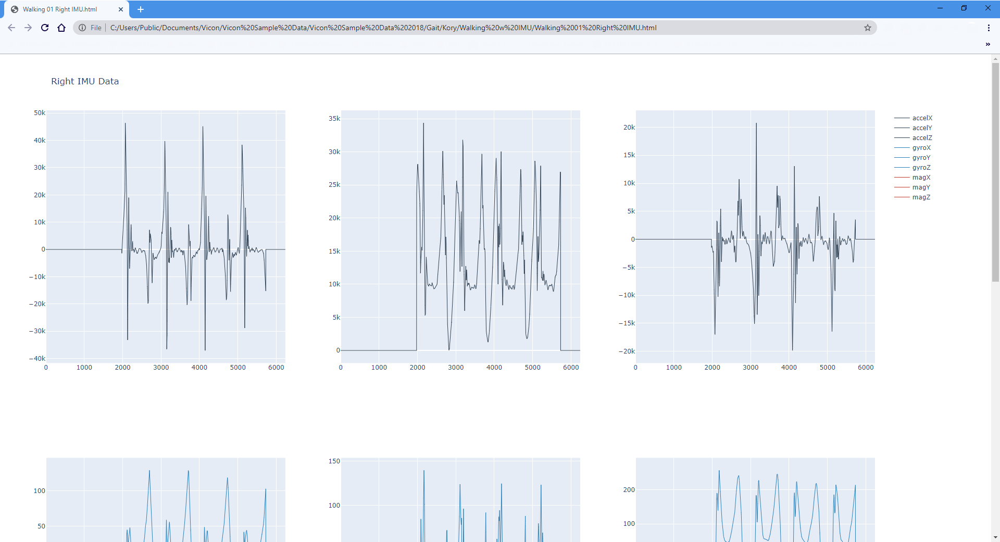

# About

This Python Code is an example code created to work in conjunction with Vicon Nexus 2.11 and Python 2.

To use the code you will need to have a trial (dataset) containing Vicon IMU data. 

The IMU data will be extacted from Nexus and displayed in your browser. 

#### IMU devices in Vicon Nexus 2.11 

#### IMU device data graphed in Vicon Nexus 2.11

#### IMU device data being graphed in web browser using plotly 

## Requirements
### Versions:
Vicon Nexus 2.11
Python version 2

### Site Packages:
plotly-4.14.3 and above
